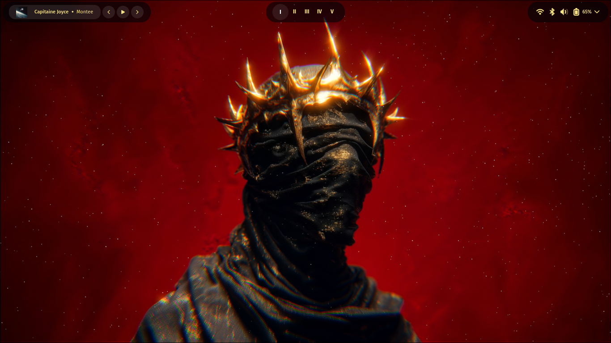

<div align="center">
  

  <h1>Direwolf Linux Desktop Shell [In Development]</h1>
  <p><strong>A modern reactive Linux desktop shell built with AGS, TypeScript, and Hyprland.</strong></p>

  
  
  
  
  
  
  
  
  

</div>

<div align="center">
  
</div>

## Overview

**Direwolf** is a modern Linux desktop shell built with Aylur's GTK Shell and powered by reactive TypeScript widgets, designed for speed, modularity, and aesthetic minimalism. This project focuses on creating a polished Hyprland experience with dynamic widgets, smooth animations, system integrations, and a clean architecture that scales as the desktop evolves.

From media controls and network indicators to workspace management and blurred glassmorphism panels, the goal is to turn the Linux desktop into a responsive control deck instead of a pile of disconnected scripts.

## Features

## Media Controls
- Play/pause, skip, and volume controls for MPRIS-compatible media players.
- Dynamic media cards showing album art, track info, and progress bars.

## Hyprland Integration
- Workspace indicators with dynamic icons and animations.
- Window titlebars with custom controls and blurred backgrounds.

## System Indicators
- Battery status, network connectivity, Bluetooth devices, and more.
- Interactive widgets for quick access to settings and information.

## Notifications
- Custom notification system with support for actions and media controls.
- Smooth animations and dynamic styling based on content.

## Screenshots


<div align="center">
  
</div>

## Getting Started

### Installation

1. **Download the latest release from github**
  ```
    download the latest zip, direwolf-vX.X.X.zip, from the releases page.
  ```
or
  ```bash
    curl -s https://api.github.com/repos/SamvitPrakash-23525119/Direwolf/releases/latest
  ```

2. **Unzip and install the files**
  ```bash
    cd direwolf-vX.X.X
  ```
  ```bash
    makepkg -sic
  ```

3. **Setup Direwolf**
  ```bash
    systemctl --user daemon-reload
  ```
   ```bash
    systemctl --user enable --now direwolf.service
   ```
4. **Check the setup was successful**
  ```bash
    systemctl --user status direwolf.service
  ```

## Project Structure

```
.
├── bin
│   └── direwolf
├── .github
│   └── workflows
│       └── releases.yml
├── LICENCE
├── makefile
├── notes
├── packaging
│   └── arch
│       ├── makefile
│       └── PKGBUILD
├── README.md
├── src
│   ├── ags
│   │   ├── app.tsx
│   │   ├── env.d.ts
│   │   ├── .gitignore
│   │   ├── modules
│   │   │   ├── Bar
│   │   │   │   └── Bar.tsx
│   │   │   ├── MediaCard
│   │   │   │   └── MediaCard.tsx
│   │   │   ├── VolumeModal
│   │   │   │   └── VolumeModal.tsx
│   │   │   └── widgets
│   │   │       ├── AudioVisualizer.tsx
│   │   │       ├── Clock.tsx
│   │   │       ├── MediaBar.tsx
│   │   │       ├── ProgressBar.tsx
│   │   │       ├── TrayBar.tsx
│   │   │       └── WorkspaceBar.tsx
│   │   ├── package.json
│   │   ├── services
│   │   │   └── share
│   │   │       ├── BatteryService.ts
│   │   │       ├── BluetoothService.ts
│   │   │       ├── HyprlandService.ts
│   │   │       ├── MprisService.ts
│   │   │       ├── NmService.ts
│   │   │       └── WpctlService.ts
│   │   ├── styles
│   │   │   ├── _animations.scss
│   │   │   ├── _clock.scss
│   │   │   ├── _colors.scss
│   │   │   ├── dist
│   │   │   │   ├── main.css
│   │   │   │   └── main.css.map
│   │   │   ├── main.scss
│   │   │   ├── _mediaBar.scss
│   │   │   ├── _mediaCard.scss
│   │   │   ├── _media.scss
│   │   │   ├── _progressBar.scss
│   │   │   ├── _tray.scss
│   │   │   ├── _volumeModal.scss
│   │   │   └── _workspace.scss
│   │   ├── tsconfig.json
│   │   └── utilities
│   │       ├── to_numerals.ts
│   │       └── workspaces.ts
│   └── hyprland
│       └── hyprland.conf
└── systemd
    └── direwolf.service
```
